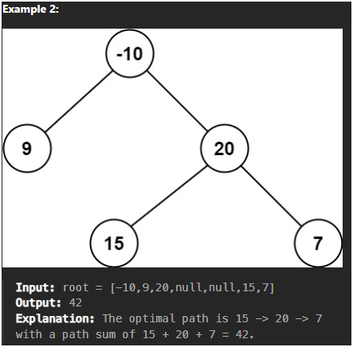

```python
class Solution(object):
    def maxPathSum(self, root):
        """
        :type root: TreeNode
        :rtype: int
        """
        # Initialize result with the root's value to handle negative-only trees
        res = [root.val]

        # Helper function to perform DFS traversal
        def dfs(root):
            if not root:
                return 0

            # Recursively calculate the maximum path sum from left and right children
            leftMax = dfs(root.left)
            rightMax = dfs(root.right)

            # If a subtree contributes a negative value, ignore it (treat it as 0)
            leftMax = max(leftMax, 0)
            rightMax = max(rightMax, 0)

            # Case when the path goes through the current node (split path)
            # i.e., left subtree + current node + right subtree
            # Update the global maximum path sum if this is the best we've seen
            res[0] = max(res[0], root.val + leftMax + rightMax)

            # For the recursion return value:
            # Only one path (left or right) can be used to extend upwards to the parent
            return root.val + max(leftMax, rightMax)

        # Start DFS from the root
        dfs(root)

        # Return the best path sum found
        return res[0]
```